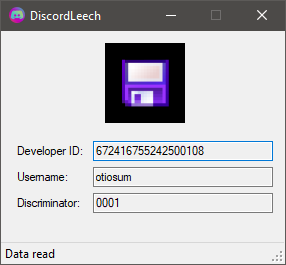

# DiscordLeech
Very simple example of how you can read user account info from running Discord process. Written in C#/.NET and using WinForms to display the output.

  

If you for some reason want to download compiled version of it then check out [releases](https://github.com/SamuelTulach/DiscordLeech/releases).